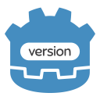

<p align="center"></p>

# GodotVersion
*From `git log` to `SemVer` to `Godot` in no time.
An automation plugin working with GitVersion*

## About
The GodotVersion plugin makes it easier to manage version updates for your Godot projects. It works with GitVersion and a git pre-commit hook to update the project version automatically when a build is started - both for debug and exports.

This plugin can be used for both game and non-game projects.

## Getting started
### 1. Installing Git
To get started with the GodotVersion plugin, you'll need to have Git installed on your machine. Use package manager like `Homebrew`, `Chocolatey` or go to the Git website and install the latest version.

> **Warning:**  
> Make sure you have version 2.9 or later of Git installed.  
>You can check your Git version by running git --version in a terminal.

### 2. Installing GitVersion
Once you have Git installed, you'll need to install GitVersion. There are several ways to install GitVersion, including using the `Homebrew` or `Chocolatey`. You can find detailed installation instructions on the [GitVersion website](https://gitversion.net/docs/usage/cli/installation).

> **Note:**  
>To learn more about GitFlow, see the [GitFlow documentation](https://docs.github.com/en/get-started/quickstart/github-flow).  
>You can customize GitVersion by editing the gitversion.yml file. See the [GitVersion documentation](https://gitversion.net/docs/usage/cli/) for details.

### 3. Installing `pre-commit` git hook

After installing GitVersion, you'll need to set up a custom `pre-commit` git hook.  
To do this, create a file called `pre-commit` in the `.git/hooks` directory of your project repository.

You can use the following script as a starting point:

```bash
#!/bin/sh

# Check that GitVersion is installed
which gitversion || exit 0

# Update the version number and commit it
gitversion -output file
git add GitVersion.json
```

### 4. Installing GodotVersion Plugin

Finally, you'll need to install the GodotVersion plugin from the Godot Asset Library. To do this, launch Godot, go to the Asset Library tab, and search for `GodotVersion`.

Once you've found the plugin, click the `Download` button to install it. And that's it!

The GodotVersion plugin now will automatically manage and track version updates for your Godot projects.

## Using in development

The GodotVersion plugin adds a new `version` property to the `ProjectSettings` object. This property is a `GitVersion.json` file in dictionary format, and it allows you to easily access the current version of your project.

To access the current project version using the version property, you can use the following code:

```gdscript 
var current_version = ProjectSettings["version"]["SemVer"]
```

This will assign the current version of the project to the `current_version` variable. You can then use this variable to display the version number in your game in a `Label` Control.
